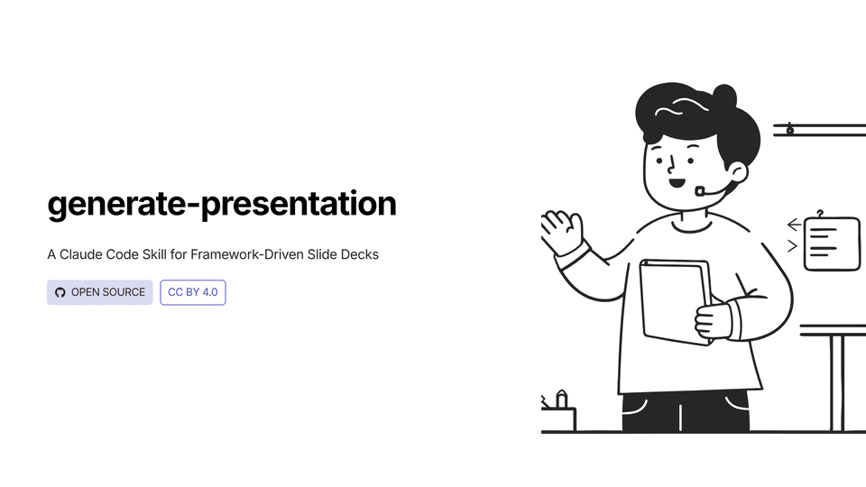
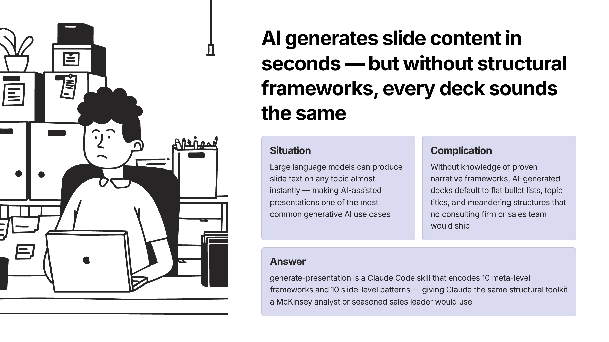
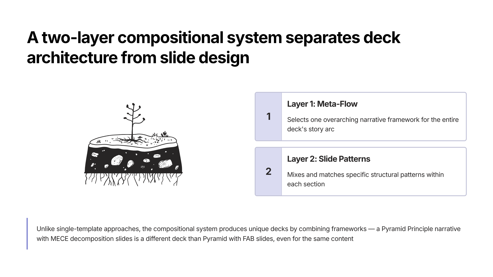
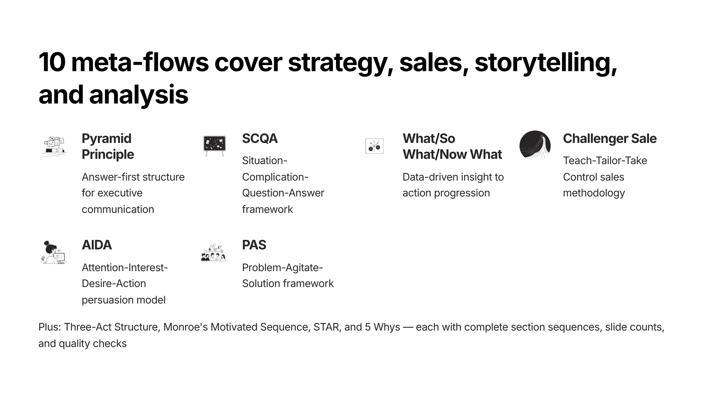
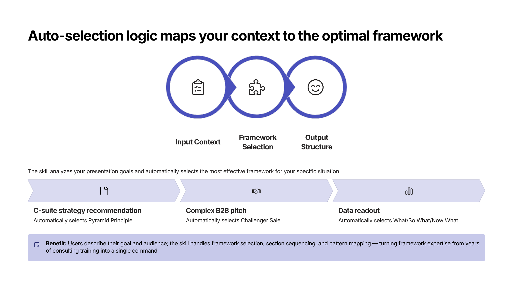
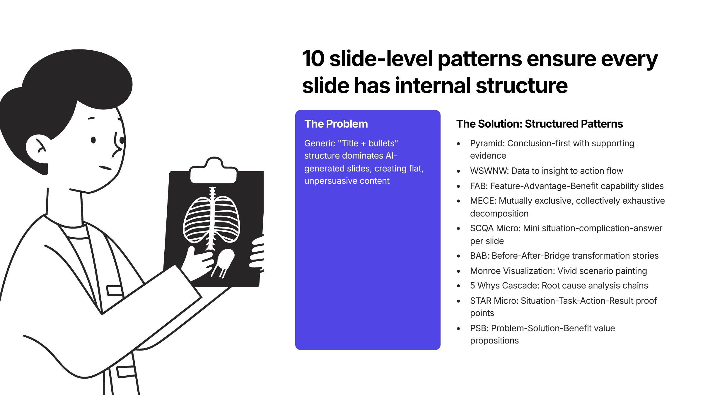
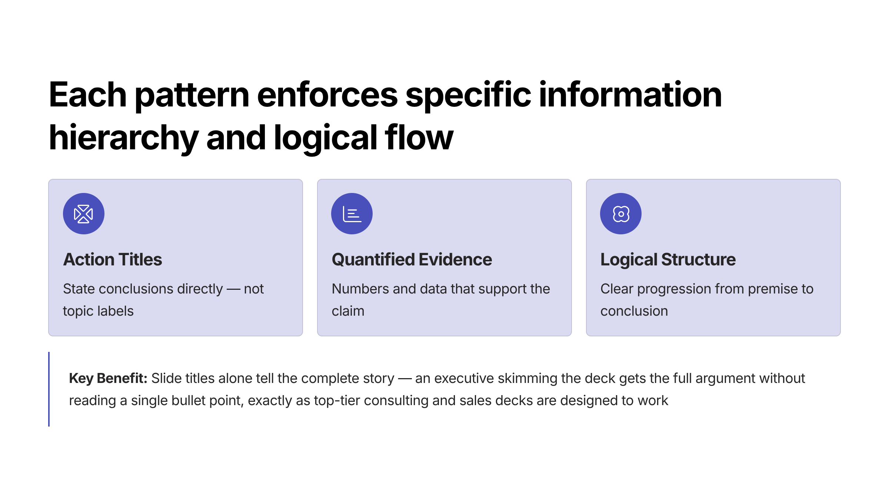
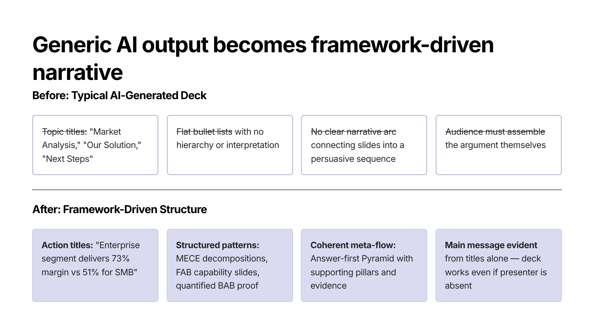
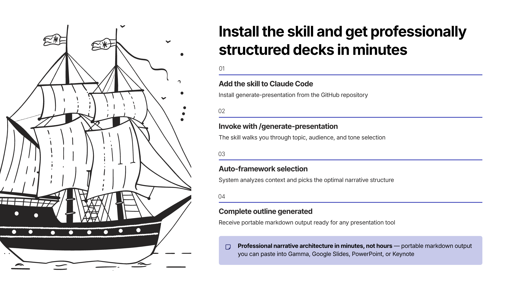
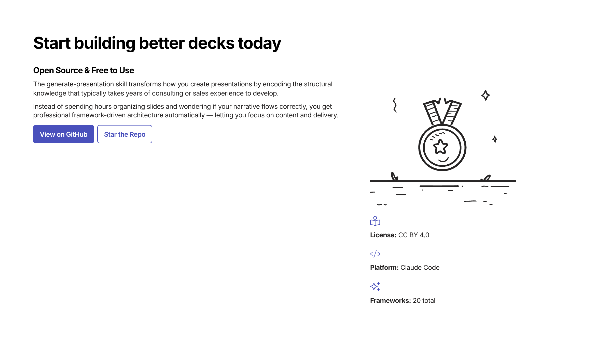

# generate-presentation

[](https://github.com/rdarneal/generate-presentation/releases)
[](https://github.com/rdarneal/generate-presentation/stargazers)
[](https://github.com/rdarneal/generate-presentation/network)
[](https://creativecommons.org/licenses/by/4.0/)

A Claude AI skill for generating professional slide decks using proven consulting, sales, storytelling, and problem-solving frameworks.



## What This Is

This is a **skill specification** for [Claude Code](https://docs.anthropic.com/en/docs/claude-code) (and compatible AI agents) that teaches Claude how to create structured presentations. There is no application code — the deliverables are Markdown documents that define presentation frameworks, patterns, and generation logic.

When installed as a Claude Code skill, typing `/generate-presentation` walks you through building a professionally structured deck using frameworks like the Pyramid Principle, SCQA, AIDA, Challenger Sale, and more.

## Two-Layer Architecture

The skill uses a compositional system that separates *deck architecture* from *slide design*:

### Layer 1: Meta-Level Flows (choose one per deck)

Overall presentation structure and narrative arc.

| Category | Frameworks |
|----------|-----------|
| Strategy & Consulting | Pyramid Principle, SCQA |
| Sales & Persuasion | Challenger Sale, AIDA, PAS |
| Storytelling | Three-Act Structure, Monroe's Motivated Sequence |
| Problem-Solving | STAR, 5 Whys, What/So What/Now What |

### Layer 2: Slide-Level Patterns (mix and match)

Reusable structures for individual slides within a deck.

| Pattern | Best For |
|---------|---------|
| Pyramid | Hierarchical arguments, MECE breakdowns |
| SCQA Micro | Setting up problem-solution slides |
| MECE | Exhaustive category breakdowns |
| BAB (Before-After-Bridge) | Transformation narratives |
| FAB (Feature-Advantage-Benefit) | Product/capability slides |
| PSB (Problem-Solution-Benefit) | Solution justification |
| STAR Micro | Evidence and case study slides |
| WSWNW (What/So What/Now What) | Data interpretation slides |
| Monroe's Visualization | Future-state contrast slides |
| 5 Whys Cascade | Root cause analysis slides |

## Repository Structure

```
SKILL.md                    # Master skill definition (primary deliverable)
references/
  meta_*.md                 # Meta-flow framework templates (10)
  slide_*.md                # Slide-level pattern templates (10)
CLAUDE.md                   # Instructions for Claude Code when working in this repo
```

## Usage

### As a Claude Code Skill

1. Add this repository's `SKILL.md` to your Claude Code skill configuration
2. Use `/generate-presentation` to invoke the skill
3. Claude will guide you through topic, audience, tone, and framework selection
4. The skill outputs a structured markdown outline you can paste into any presentation tool

### As a Reference

The framework templates in `references/` are useful on their own as guides for structuring presentations manually.

## Example Output

This presentation was generated by the skill itself — showcasing the project using the AIDA meta-flow with SCQA Micro, FAB, BAB, and PSB slide patterns.

### Step 1: Skill generates a structured markdown outline

Use `/generate-presentation` in Claude Code to produce a framework-driven presentation outline.

<details>
<summary>View the markdown outline</summary>

```markdown
# generate-presentation
A Claude Code Skill for Framework-Driven Slide Decks
Open Source | CC BY 4.0 | github.com/rdarneal/generate-presentation

---

# AI generates slide content in seconds — but without structural frameworks, every deck sounds the same
<!-- Pattern: SCQA Micro | Section: Attention -->

**SITUATION**
Large language models can produce slide text on any topic almost instantly — making AI-assisted presentations one of the most common generative AI use cases

**COMPLICATION**
Without knowledge of proven narrative frameworks, AI-generated decks default to flat bullet lists, topic titles, and meandering structures that no consulting firm or sales team would ship

**ANSWER**
generate-presentation is a Claude Code skill that encodes 10 meta-level frameworks and 10 slide-level patterns — giving Claude the same structural toolkit a McKinsey analyst or seasoned sales leader would use

---

# A two-layer compositional system separates deck architecture from slide design — so you get the right structure at every level
<!-- Pattern: FAB | Section: Interest — Architecture Overview -->

**FEATURE**
Two independent layers: Layer 1 selects one meta-flow for the overall narrative arc, Layer 2 mixes and matches slide-level patterns within each section

**ADVANTAGE**
Unlike single-template approaches, the compositional system produces unique decks by combining frameworks — a Pyramid Principle narrative with MECE decomposition slides is a different deck than Pyramid with FAB slides, even for the same content

**BENEFIT**
Every presentation gets both a proven macro-structure (so the story holds) and purpose-built micro-structures (so each slide lands) — without manual framework selection or structural guesswork

---

# 10 meta-flows cover strategy, sales, storytelling, and analysis — with auto-selection logic that picks the right one
<!-- Pattern: FAB | Section: Interest — Layer 1 Detail -->

**FEATURE**
Pyramid Principle, SCQA, What/So What/Now What, Challenger Sale, AIDA, PAS, Three-Act Structure, Monroe's Motivated Sequence, STAR, and 5 Whys — each with complete section sequences, slide counts, and quality checks

**ADVANTAGE**
Auto-selection logic maps purpose, audience, and time constraints to the optimal framework — C-suite strategy recommendation automatically selects Pyramid Principle; complex B2B pitch selects Challenger Sale; data readout selects What/So What/Now What

**BENEFIT**
Users describe their goal and audience; the skill handles framework selection, section sequencing, and pattern mapping — turning framework expertise from years of consulting training into a single command

---

# 10 slide-level patterns ensure every slide has internal structure — not just bullets on a page
<!-- Pattern: FAB | Section: Interest — Layer 2 Detail -->

**FEATURE**
Pyramid, WSWNW, FAB, MECE, SCQA Micro, BAB, Monroe Visualization, 5 Whys Cascade, STAR Micro, and PSB — each with layout diagrams, title formulas, before/after examples, and audience adaptation guides

**ADVANTAGE**
Each pattern enforces a specific information hierarchy: action titles that state conclusions, quantified evidence, and logical flow — replacing the generic "Title + bullets" structure that dominates AI-generated slides

**BENEFIT**
Slide titles alone tell the complete story — an executive skimming the deck gets the full argument without reading a single bullet point, exactly as top-tier consulting and sales decks are designed to work

---

# Generic AI output becomes framework-driven narrative when the skill selects Pyramid Principle and maps MECE + FAB patterns to each section
<!-- Pattern: BAB | Section: Desire -->

**BEFORE**
- Topic titles: "Market Analysis," "Our Solution," "Next Steps"
- Flat bullet lists with no hierarchy or interpretation
- No clear narrative arc connecting slides into a persuasive sequence
- Audience must assemble the argument themselves

**AFTER**
- Action titles: "Enterprise segment delivers 73% margin vs 51% for SMB"
- Structured patterns: MECE decompositions, FAB capability slides, quantified BAB proof
- Coherent meta-flow: answer-first Pyramid with supporting pillars and evidence
- Main message evident from titles alone — deck works even if the presenter is absent

**BRIDGE**
The skill reads the relevant meta-flow and slide-pattern templates from 20 reference files, then generates each slide following the pattern's title formula, element guide, and quality checklist

---

# Install the skill, type one command, and get a professionally structured deck in minutes
<!-- Pattern: PSB | Section: Action -->

**PROBLEM**
Building a well-structured presentation requires knowing which framework fits the context, how to sequence sections, and how to structure each slide — knowledge that typically takes years of consulting or sales experience to develop

**SOLUTION**
Add generate-presentation as a Claude Code skill and invoke it with `/generate-presentation` — the skill walks you through topic, audience, and tone, then auto-selects the optimal framework and generates a complete outline

**BENEFIT**
Professional narrative architecture in minutes, not hours — portable markdown output you can paste into Gamma, Google Slides, PowerPoint, or Keynote

- GitHub: github.com/rdarneal/generate-presentation
- License: CC BY 4.0
- Star the repo and start building better decks today
```

</details>

### Step 2: Feed the outline to a presentation tool

Paste the markdown output into Claude Desktop (with the [Gamma MCP](https://gamma.app) server configured) using a prompt like:

> Use gamma MCP 'generate' to turn the following outline into a presentation. Use the following parameters for 'generate'. textMode: preserve, format: presentation, image option source: pictographic, dimensions 16x9

The result is a polished, visually designed deck: [View the full presentation on Gamma](https://gamma.app/docs/generate-presentation-sauuzp1x2y3zvda)

<details>
<summary>View the 10 rendered slides</summary>




















</details>

## License

This work is licensed under [CC BY 4.0](https://creativecommons.org/licenses/by/4.0/). See [LICENSE.md](LICENSE.md) for details.
